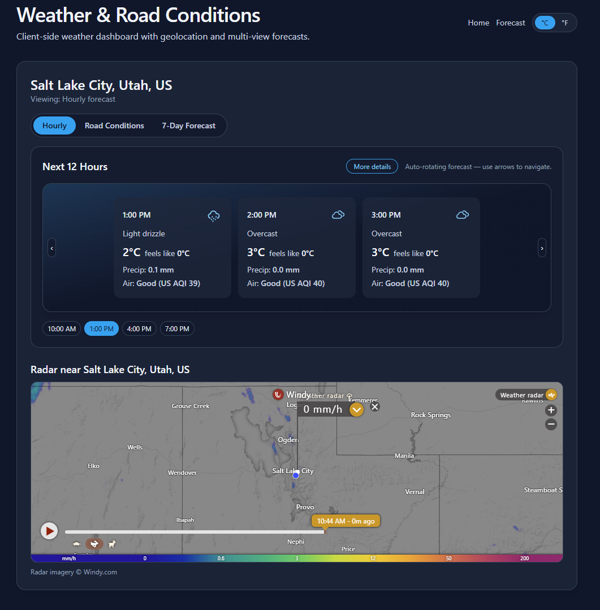

# 📘 Weather Forecast App
*A clean, fast, modern weather experience powered by real-time data.*

## 🌤️ Overview
This project is a **React + Vite** single-page application that displays **current conditions, hourly forecasts, daily outlooks, and road conditions** for any location.

It works entirely on the **client side** — **no backend server required**. All weather, location, and air-quality data is fetched directly from public APIs.

Users can:
- Search by **ZIP code** or **City, State**
- Use their **current location**
- View **12-hour** detailed forecasts
- Check **7-day outlook**
- Inspect **road condition risk**
- See air-quality summaries (AQI, PM2.5, PM10)
- Toggle between **metric** and **imperial** units

---

## ✨ Features

### 🔍 Location Search
- Search by ZIP or City, ST
- “Use My Location” with browser geolocation

### 🕒 Hourly Forecast
- Temperature, feels-like, precipitation
- Winds, gusts, humidity, cloud cover, visibility
- Air quality summary
- Auto-rotating carousel with a timeline navigator
- Expandable “More Details” drawer

### 📅 7-Day Forecast
- Daily highs/lows
- Sunrise/sunset
- Weather descriptions
- UV max index

### 🚗 Road Conditions
- Dry / Wet / Snow-Ice Risk classification
- Based on temp, precipitation, and condition codes

### 🌫️ Air Quality
- US AQI, PM2.5, PM10, dust
- Category + summary text

### ⚡ Fast UI
- Built with React + Vite + TailwindCSS

### 📦 Smart Caching
- LocalStorage cache (15-minute TTL)
- Fast reloads when revisiting locations

---

## 🗺️ Data Sources

| Purpose | API |
|--------|------|
| Weather (hourly/daily/current) | Open-Meteo Forecast API |
| Location search | Open-Meteo Geocoding API |
| Air quality | Open-Meteo Air Quality API |
| Reverse geocoding | OpenStreetMap Nominatim |

No API keys required.

---

## 🧭 Using the App

### Search
Enter:
- `80202`  
- `Denver, CO`  
Then click **Get Forecast**.

### Use My Location
Allows browser to access coordinates → reverse-geocoded city name → forecast loads.

### Tabs
- **Hourly**
- **Road Conditions**
- **7-Day Forecast**

### Units
Toggle Metric ↔ Imperial via header button.

---

## 🛠️ Installation

### 1. Clone
```
git clone <your-repo-url>
cd <repo>
```

### 2. Install
```
npm install
```

### 3. Run Dev Server
```
npm run dev
```

### 4. Build
```
npm run build
npm run preview
```

---

## 🔐 Permissions
The app may request **geolocation access** if you choose to use “Use My Location.”  
Coordinates never leave your device.

---

## 💾 Caching Behavior
- Cache TTL: **15 minutes**
- Max entries: **5**
- Cached results load instantly

---

## 🧩 Browser Support
- Chrome  
- Firefox  
- Safari  
- Edge  

Fully responsive.

---

## 🖼️ Screenshots (Optional)
```



```

---

## 📝 License
MIT License.

---

## 🙋 For Developers
See **DEVELOPER_README.md** for service architecture, component flow, and extension guidelines.
